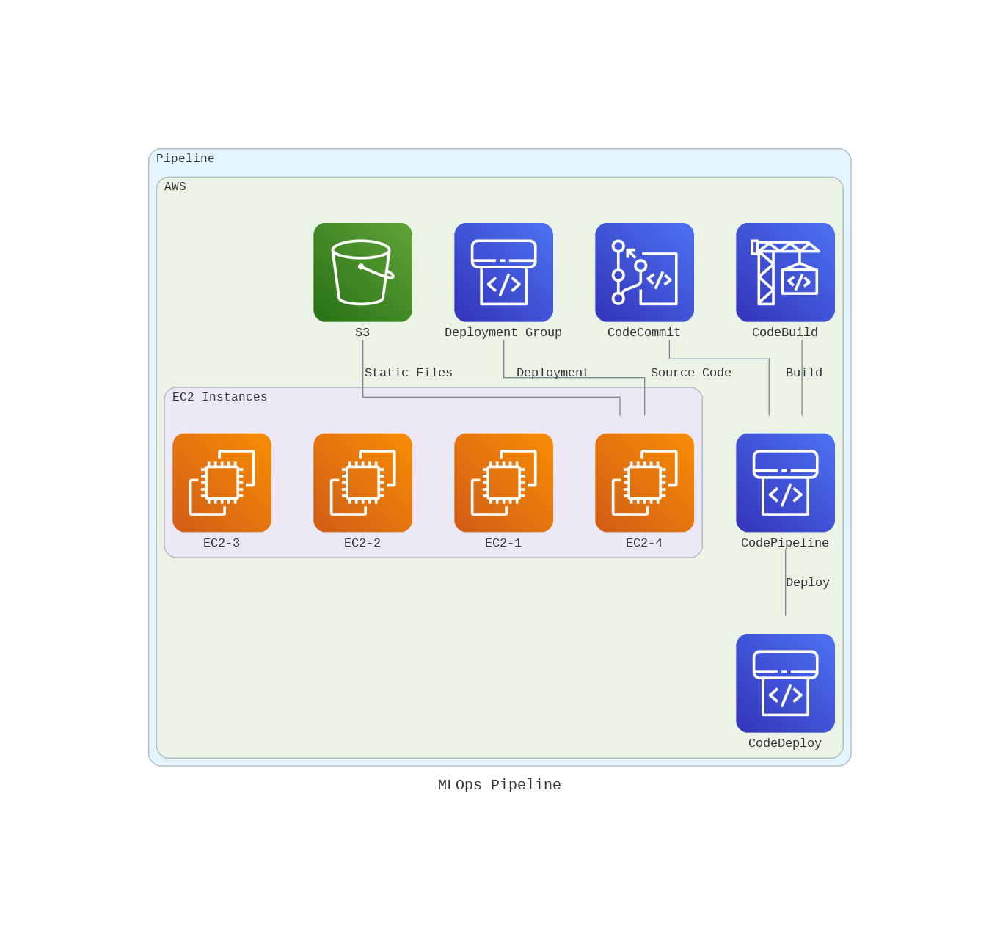

# MLOps Pipeline

This repository contains an MLOps pipeline implemented using Terraform for infrastructure provisioning and AWS services. The pipeline automates the deployment of machine learning models and associated resources.

## MLOps Architecture

You can visualize the architecture by running the Python script provided in the `src` folder. Execute `python src/diagram.py` to generate a diagram and save it in the `images` folder as `pipeline.png`.



## Pipeline Overview

The MLOps pipeline described in this project automates the deployment of machine learning models and related resources. It leverages a combination of AWS services and Terraform for infrastructure provisioning. Below is an in-depth explanation of each component's functionality within the pipeline:

1. **CodeCommit (Version Control):**
   - **Purpose:** This module serves as the version control system for your project's source code and related files.
   - **Functionality:** You can track changes to your data and collaborate with team members using CodeCommit. It allows you to store and manage your machine learning code and configuration files.

2. **CodeBuild (Build Phase):**
   - **Purpose:** CodeBuild is responsible for building your machine learning models.
   - **Functionality:** It runs automated build processes, including compiling code, running tests, and packaging model artifacts. CodeBuild ensures that your models are built correctly and consistently.

3. **CodePipeline (Orchestration):**
   - **Purpose:** CodePipeline orchestrates the entire pipeline and automates the flow of changes from source code to deployment.
   - **Functionality:** It defines a series of stages and actions that your code changes go through. In this pipeline, it coordinates the build and deployment phases, ensuring that each step is executed in the correct order.

4. **CodeDeploy (Deployment):**
   - **Purpose:** CodeDeploy automates the deployment of your machine learning models to EC2 instances.
   - **Functionality:** It ensures that your models are deployed consistently and efficiently across multiple EC2 instances. CodeDeploy can perform rolling deployments, allowing you to update your models with minimal downtime.

5. **Deployment Group (Deployment Configuration):**
   - **Purpose:** The deployment group specifies the configuration for deploying models to EC2 instances.
   - **Functionality:** You can define deployment settings such as the EC2 instances where the models should be deployed, deployment type (in-place or blue/green), and other deployment-related configurations.

6. **EC2 Instances (Compute Resources):**
   - **Purpose:** These are the virtual machines where your machine learning models are hosted and run.
   - **Functionality:** EC2 instances provide the compute resources necessary to execute your models. You can customize the instance types, security settings, and more to meet the requirements of your machine learning tasks.

7. **S3 (Storage):**
   - **Purpose:** S3 is used to store static files required for the pipeline, such as model artifacts or configuration files.
   - **Functionality:** You can store and manage files in S3 buckets, making them accessible to other components of the pipeline, like the EC2 instances during deployment.

This MLOps pipeline streamlines the process of building, deploying, and managing machine learning models. It ensures that changes to your code and models are tracked, tested, and deployed reliably and consistently, reducing the manual effort required for these tasks and improving the overall efficiency of your machine learning workflows.

## Project Structure

```
├── architecture
│   └── terraform
│       ├── main.tf
│       └── modules
│           ├── codebuild
│           │   ├── main.tf
│           │   └── outputs.tf
│           ├── codecommit
│           │   ├── main.tf
│           │   ├── outputs.tf
│           │   └── variables.tf
│           ├── codedeploy
│           │   ├── main.tf
│           │   └── outputs.tf
│           ├── codepipeline
│           │   ├── main.tf
│           │   └── variables.tf
│           ├── deployment_group
│           │   ├── main.tf
│           │   └── outputs.tf
│           ├── ec2
│           │   ├── main.tf
│           │   ├── outputs.tf
│           │   └── user_data.sh
│           └── s3
│               ├── main.tf
│               └── outputs.tf
├── images
│   └── pipeline.png
└── src
    ├── diagram.py
    └── requirements.txt
```

## Usage

1. Clone this repository.
2. Modify the Terraform configurations in the `architecture/terraform` directory to match your requirements.
3. Run `terraform init` to initialize the Terraform project.
4. Run `terraform apply` to create the AWS resources.
5. Monitor the pipeline and access your deployed models.

## Requirements

Ensure you have the necessary dependencies installed by running:

```bash
pip install -r src/requirements.txt
``````

## License

This project is licensed under the MIT License. file for details.

## Contact

For any questions or inquiries, please contact:

- [PedroAlves](pedroalves0409@gmail.com)
- [LinkedIn](https://www.linkedin.com/in/pedro-a-d-s/)
